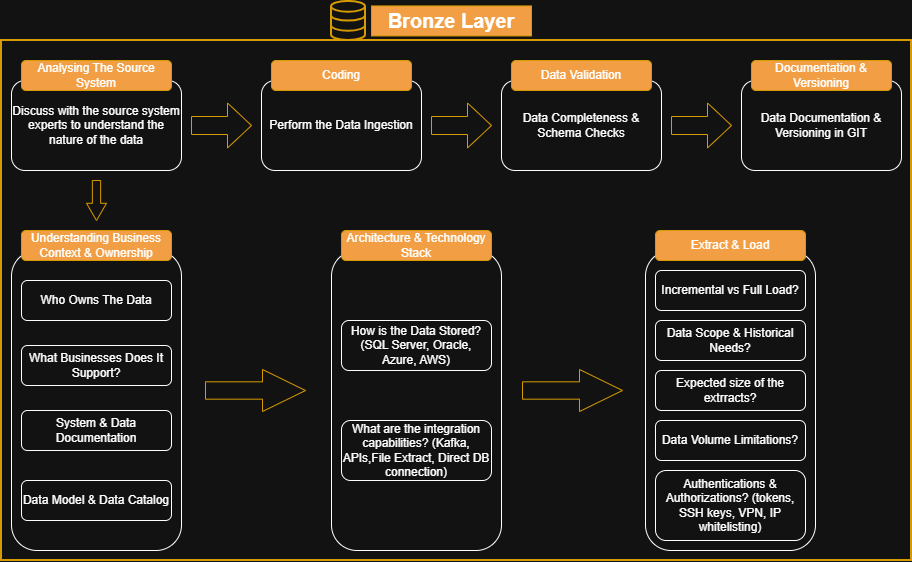

# Data Warehouse & Analytics Project

### Building an advanced data warehouse with SQL Server, including ETL processes, data modelling and analytics

Welcome to the **Data Warehouse and Analytics Project** repository!
This project demostrates a comprehensive data warehousing and analytics solution, from building a warehouse to generating actionable insights. It is a portfolio project that highlights industry best practices in data engineering and analytics.

---

## Project Requirements

### Building The Data Warehouse (Data Engineering)

#### Objective
Develop an advanced data warehouse using SQL Server to consolidate sales data, enabling analytical reporting and informed decision-making.

#### Specifications
- **Data Sources**: Import data from two source systems (ERP and CRM) provided as CSV files.
- **Data Quality**: "Clean and Fix" data wuality issues before final analysis.
- **Intergration**: Combine both sources into one single, user-friendly data model designed for easy and quick analytical queries.
- **Scope**: Focus on the latest dataset only. Historization of the data is not required.
- **Documentation**: Provide clear documentation of the data model to support both business stakeholders and analytics teams.

---

### BI: Analytics & Reporting (Data Analytics)

#### Objective
Develop SQL-based analytics to deliver detailed insights into:
- **Customer Behavior**
- **Product Performance**
- Sales Trends**

These insights empower stakeholders with key business metrics, enabling strategic decision-making

---

# Data Architecture

### The data architecture will be based on the "Medallion Architecture"
- **Bronze Layer**: This layer will hold the raw, untouched, unfiltered data so that there can be sort of historization for easy roll-backs when something breaks at the other 2 layers.
- **Silver Layer**: Cleaned, and transformed data. This is where I handle nulls, fix data types, deduplicate, and join datasets. Data is trustworthy here.
- **Gold Layer**: Business-ready, aggregated data. Optimized for reporting, dashboards, and analytics.

